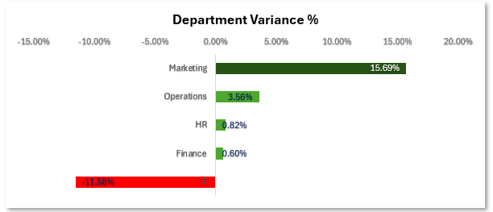
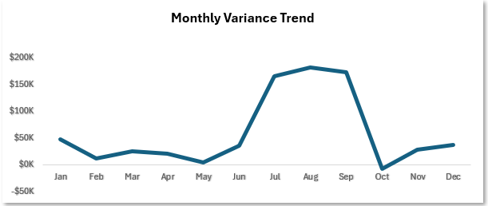
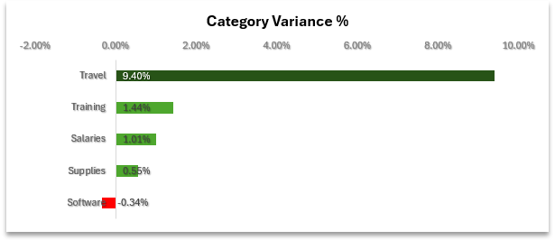
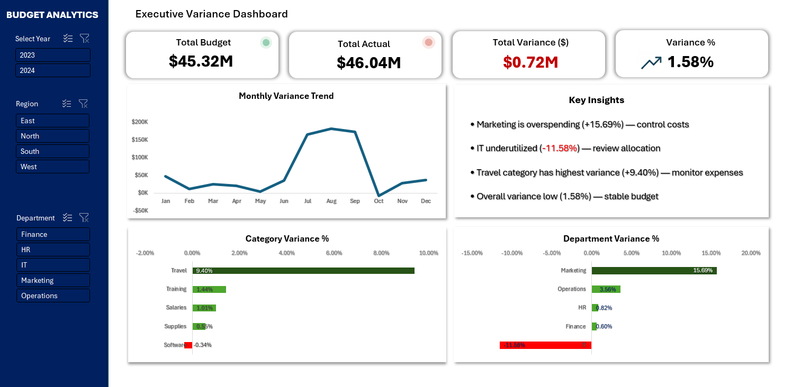
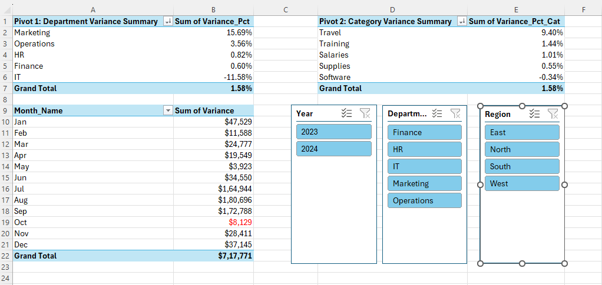

<div align="center">

# Budget vs Actual Variance Analysis & Cost Control Dashboard

**Excel | Power Query | Pivot Tables | Slicers | Advanced Formulas**

Built an Excel dashboard that identifies overspending across departments and highlights where immediate cost control is required.

This is not a reporting tool — it’s a decision tool.

It answers one question clearly: **Where is money being wasted, and what needs to be fixed?**


</div>

---

## Problem Statement

Most companies track budget vs actual in Excel.

But in reality:
- Data sits in spreadsheets
- No one monitors it monthly
- Overspending is noticed too late

By the time finance teams react, the damage is already done.

This dashboard solves that by giving a clear, real-time view of:
- Which departments are overspending
- Which cost categories are driving it
- Whether the problem is getting worse over time

**Core question: Where is the company overspending, and which departments need immediate cost control?**

---

## Why This Matters

- This is a real FP&A problem (not a practice dataset)
- Most companies still use Excel for budget tracking
- A clear dashboard can prevent cost overruns before they escalate

This is the kind of analysis expected from a finance or business analyst — not just charts, but decisions.

---

## The Dataset

This is a **synthetic dataset** built to simulate realistic budget behaviour over 24 months.

| Detail | Info |
|--------|------|
| **Rows** | 2,400 |
| **Timeframe** | Jan 2023 — Dec 2024 |
| **Departments** | Marketing, IT, HR, Operations, Finance |
| **Categories** | Salaries, Software, Travel, Supplies, Training |
| **Regions** | North, South, East, West |
| **Cost Centers** | CC-100 through CC-500 (mapped to departments) |

The data has realistic patterns built in — some departments consistently overspend, some underspend, one category spikes every Q3, and one department is volatile month to month. These patterns are what make the dashboard interesting to explore.

---

## What the Dashboard Shows

### KPI Cards

Five numbers at the top that give the full picture in one glance — Total Budget, Total Actual, Total Variance, Overall Variance %, and the Worst Department.

### Department Variance Chart

Marketing is the biggest overspender (+15.69%), while IT consistently underspends (-11.58%), indicating inefficient allocation.



### Monthly Budget vs Actual Trend

Spending exceeds budget consistently during Q3 across both years, indicating a recurring seasonal cost spike rather than a one-time issue.



### Category Variance

Bar chart breaking down variance by cost category. Travel is the biggest problem at 9.40% over budget — driven almost entirely by the Q3 seasonal spike.



### Interactive Slicers

Three slicers — Department, Region, and Year — that filter everything at once. Click "Marketing" and all charts, all pivots update together. Click "2024" and you see just that year.

### Full Dashboard View



---

## Key Findings

**1. Marketing is the biggest overspender**
15.69% over budget across 24 months. This isn't a one-time spike — it's consistent. Every single month, Marketing spends more than planned.

**2. IT consistently underspends**
-11.58% under budget. They're either overplanning their budget or delaying projects. Either way, that money could be allocated somewhere else.

**3. Travel category spikes every Q3**
July, August, and September show 30-40% overspend in the Travel category — across all departments, not just one. This is a seasonal pattern that should be planned for, not surprised by.

**4. HR is the most stable department**
0.82% variance. Almost exactly on budget every month. Whatever they're doing for planning, it works.

**5. Operations are unpredictable**
3.56% overspend overall, but the month-to-month numbers swing wildly. Some months they're under, some months way over. This needs investigation.

---

## Pivot Analysis

Three pivot tables power the analysis — each one answering a different question.

| Pivot | Question It Answers |
|-------|-------------------|
| Department Variance | Which departments are most over/under budget? |
| Category Variance | Which cost types are driving the overspend? |
| Monthly Variance by Year | When does overspending happen — is it seasonal? |

All three pivots are connected to the same slicers, so filtering one filters all.



---

## Excel Skills Used

| Feature | Where It's Used |
|---------|----------------|
| **Power Query** | Loaded and transformed raw CSV — fixed data types, created Month_Year column |
| **Named Tables** | tbl_Budget, tbl_Department, tbl_Threshold — clean formula references |
| **Pivot Tables** | 3 pivots with calculated fields (Variance_Pct) |
| **Pivot Charts** | Charts built using pivot tables and structured Excel ranges, fully connected to slicers |
| **Slicers** | 3 slicers (Department, Region, Year) connected to all pivots |
| **SUMIFS** | KPI calculations, department and category totals |
| **XLOOKUP** | Cost centre lookups, department references |
| **LET** | Readable variance formulas |
| **FILTER / SORT / UNIQUE** | Dynamic Top 3 Worst Departments — auto-updates |
| **INDEX + SORT + SEQUENCE** | Top 3 ranking using modern dynamic arrays |
| **IF (nested)** | Status classification: Overspend (>5%), Underspend (<-5%), On Budget |
| **Conditional Formatting** | Colour scales on variance, red for negative values |
| **Custom Number Formats** | Currency formatting, red negatives |
| **Data Validation** | Lookup tables for department-cost center mapping |

---

## Workbook Structure

| Sheet | What's Inside |
|-------|-------------|
| **Raw Data** | 2,400 rows loaded via Power Query. Named table with calculated Variance, Variance_%, and Status columns. |
| **Lookup Tables** | Department → Cost Center mapping. Variance threshold definitions (±5%). |
| **Calculations** | Hidden sheet. All advanced formulas — KPIs, department summaries, Top 3 ranking, monthly trend data, category breakdowns. |
| **Pivot Analysis** | 3 pivot tables with calculated fields. Connected to slicers. |
| **Dashboard** | KPI cards, 3 pivot charts, 3 slicers. The main deliverable. |
| **Insights** | 5 decision-focused bullets — no explanations, just actions. |

---

## Insights (Decisions Only)

- Marketing consistently overspends — review budget allocation and control measures
- IT underutilises the budget — possible over-planning or delayed execution
- Travel category spikes in Q3 — consider seasonal budget adjustment
- HR budget is stable — maintain current planning approach
- Operations show high month-to-month variance — investigate underlying causes

---

## Variance Rules

| Status | Condition | Action |
|--------|-----------|--------|
| **Overspend** | Variance % > +5% | Investigate and control |
| **On Budget** | Between -5% and +5% | No action needed |
| **Underspend** | Variance % < -5% | Review allocation |

The 5% threshold matches how finance teams actually operate. Most companies flag spending issues at 5%, not 10%.

---

## Business Impact

If used in a real company, this dashboard would:

- Identify overspending early (before month-end)
- Help reallocate unused budget (e.g., IT underspend)
- Highlight seasonal cost spikes (e.g., Travel in Q3)
- Improve financial planning accuracy

This turns raw budget data into actionable decisions.

---

## Why This Project Stands Out

- Not just charts — clear decision-making
- Designed for real finance use (not an academic dataset)
- Handles dynamic filtering with consistent logic
- Focused on business impact, not just visuals

Most Excel dashboards show data. This one explains what to do with it.

---

## Project Structure

```
budget-variance-dashboard/
│
├── budget_variance_dashboard.xlsx         # The deliverable (full dashboard)
├── budget_data.csv                        # Synthetic dataset (2,400 rows)
├── README.md
│
└── images/
    ├── dashboard_overview.png
    ├── department_variance.png
    ├── monthly_trend.png
    ├── category_variance.png
    └── pivot_analysis.png
```

---

## How to Use This Dashboard

1. Download the repo
   ```bash
   git clone https://github.com/analytics-ak/budget-variance-dashboard.git
   ```

2. Open `budget_variance_dashboard.xlsx` in Excel

3. If prompted, click **Enable Content** (for data connections)

4. Use the slicers on the Dashboard sheet to filter by Department, Region, or Year

5. All charts and pivots update together when you change a filter

6. Check the Insights sheet for the key decisions

---

## Profile

* 🔗 **LinkedIn:** [View My Profile](https://www.linkedin.com/in/analytics-ashish/)
* 💻 **GitHub Repository:** [Budget Variance Dashboard](https://github.com/analytics-ak/budget-variance-dashboard)

<br>

## Author

**Ashish Kumar Dongre**
Data Analyst

- Excel | Power Query | Pivot Tables | Dashboard Design
- Focus: **Turning business data into clear, actionable decisions**
